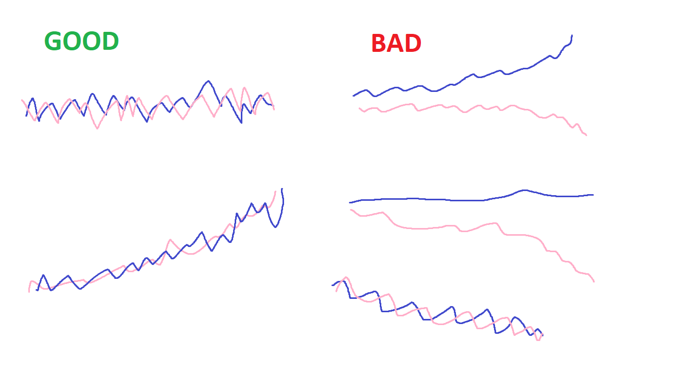
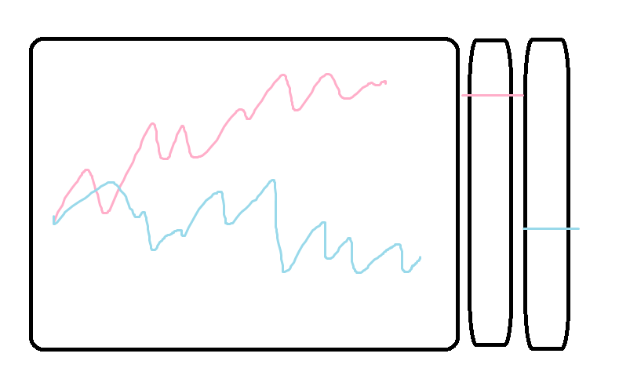
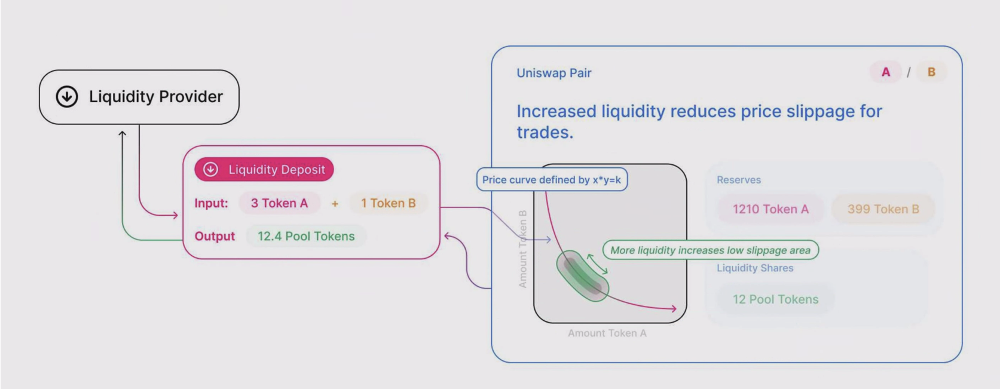
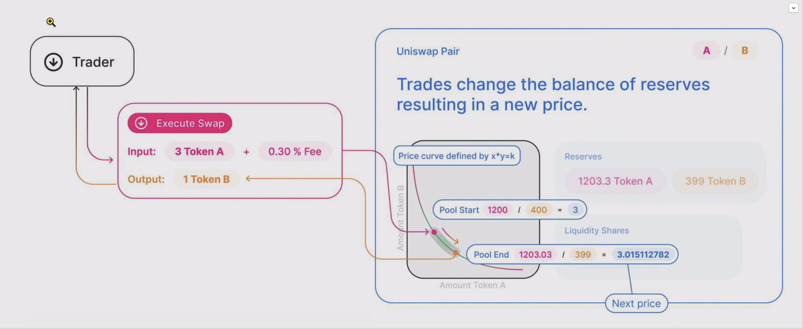
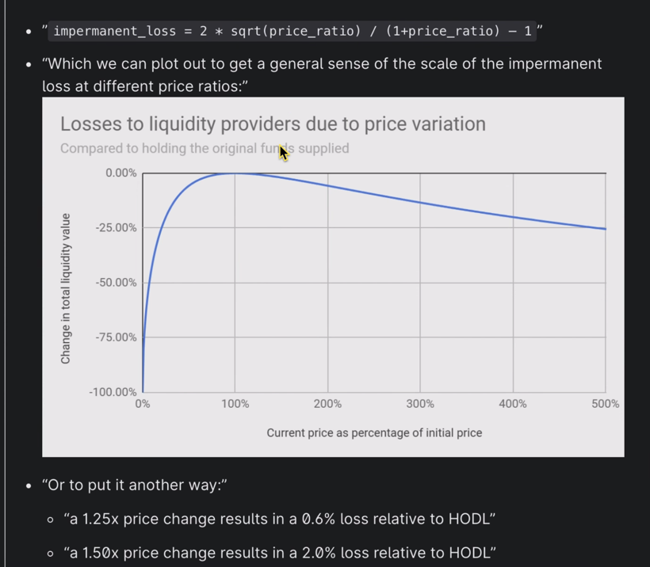
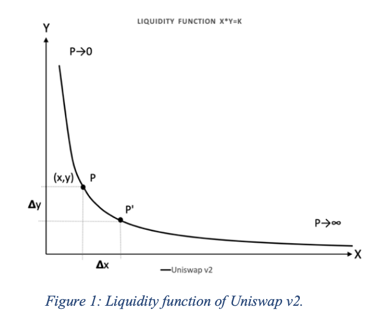
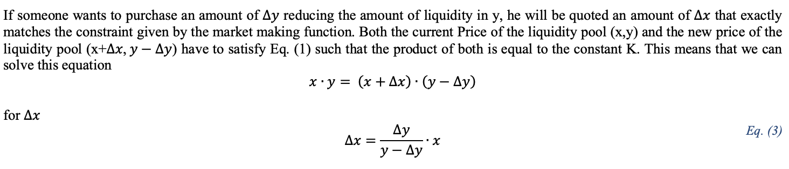
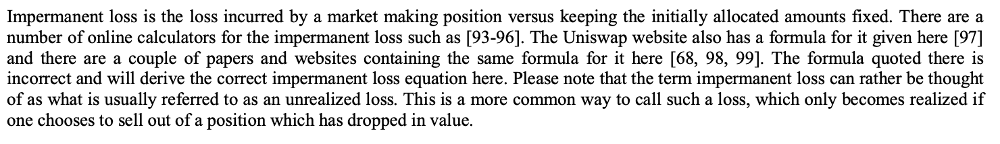

Person input:

Input coin
 - Coin A
 - Coin B
   (MVP we will default to ETH-USDc)

Input dates
 - Date 1
 - Date 2
 
 Select exchange:
 - xyk 
 - AMM function
 - Curve etc
 
Widget output:

 - squigglies of real data - some kind of data plot UI thing
 
 - fees collected
 - divergence loss suffered
 - net pnl
 - apr ??
 - adding in some line

### Math
$x \times y = K$
$x$ and $y$ are *amounts of* tokens in the Liquidity Pool, $K$ is the total liquidity product, and the ratio that the UniV2 AMM keeps constant after each swap.

The ratio of the two assets in the pool is the exchange rate $P$:
$\frac{x}{y} = P$

It follows that the coin reserves of a Liquidity Pool can be expressed in terms of price $P$ and constant $K$:

$x = \sqrt{K \times P}$
$y = \sqrt{\frac{K}{P}}$

DL is the difference between the value of a portfolio managed by an xyk AMM function and the same account with fixed amounts of the same tokens.
$DL = \sqrt{R} - \frac{R+1}{2}$
where $R$ is the ratio of the initial (at deposit) and new price
$R = \frac{P_1}{P_0}$

From pg6 of paper:
> ...The liquidity provider has a near linear relationship with price moves around the initial price only. When the price drops to zero the portfolio value drops sharply to zero, since the liquidity provider is buying more and more of the asset losing its value until the price is exactly zero and all of the other liquidity asset has dropped to zero. When the price increases the liquidity provider loses more and more of the upside gains since he is selling more and more of the appreciating asset as the price increases. This is the reason why the liquidity provider is losing money in both directions. He is buying the asset that is dropping in value and selling the asset that is rising in value. Ideally the liquidity provider wants the asset prices to hover around his initial price, so one can therefore think of the liquidity provider being ‘short volatility’ and ‘short convexity’...

### Linkies

