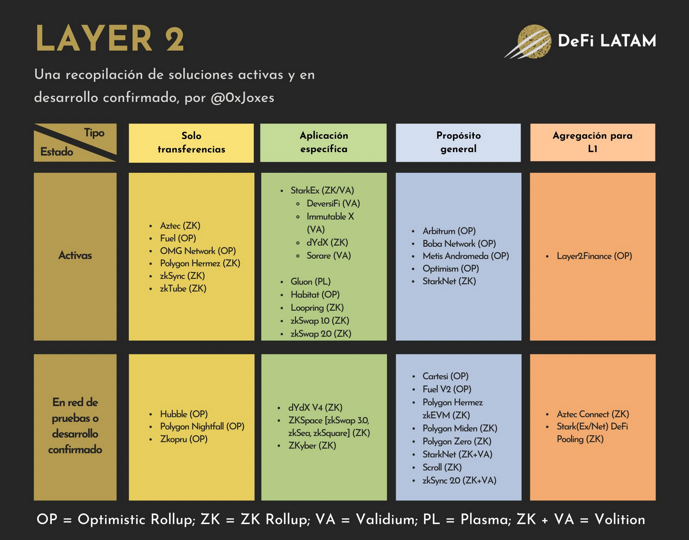

## What is it? / Why

Layer 2s can make blockchain networks cheaper, faster, and therefore more useful for more people.

Blockchain systems offer great technological benefits for money transfers and record-keeping in general; the main
properties most often considered are decentralisation, trust– and permissionlessness, censorship resistance and
immutability.

These desired properties of decentralised networks come at the cost of limited throughput, however. Even the most
prominent networks of today, Bitcoin and Ethereum are only able to handle a fairly limited amount of transactions in a
given time period; an average BTC transfer takes about 10 minutes, and some interactions with Ethereum dApps can cost
hundreds of dollars in gas fees during congested times.

Newer blockchain networks may have somewhat better performance in some aspects, but ultimately all of them suffer from
the above tradeoff between speed/accessibility and security. Layer 2 refers to solutions to this problem that scale up
networks by building a secondary protocol that inherits the security guarantees of the base layer.

## Types

Scaling solutions to blockchains are an advanced topic with much ongoing research and development. The technical
descriptions and differences between each is beyond the scope of this explainer, but they are well worth researching for
the curious.

For Bitcoin, the most notable L2 solution is Lightning Network.

Ethereum has numerous Layer 2 implementations, with the two main approaches being Optimistic Rollups and Zero-Knowledge
Rollups.

## Rewards

The main benefit of using Layer 2s is lower fees and/or improved speed. On top of this, early adapters of new scaling
networks can be rewarded by receiving tokens for their bravery from network and app developers, as a bonus.

## Risk implications

As with any novel software or technology, it is not without its dangers. Getting funds from an L1 base layer to an L2 typically involves
a so-called bridging process; this transaction can be costly and take some time, depending on the particular
implementation. 

It is advisable to test with a small transaction first, to make sure the software works in the expected way, and to
familiarise ourselves with the process, as it can sometimes be unclear.

## Links

https://help.aurora.dev/article/53-is-aurora-l1-or-l2

https://academy.binance.com/en/glossary/layer-2

https://twitter.com/DeFi_LATAM/status/1482011704661889024

https://coinmarketcap.com/alexandria/article/what-are-cryptocurrency-layer-2-scaling-solutions

