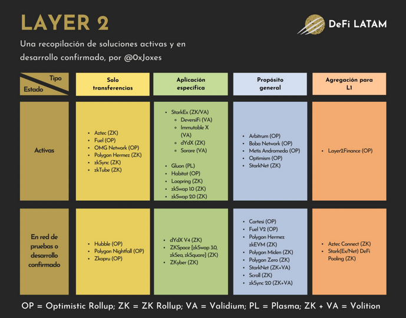

## What is it?

secondary protocol on top of a layer one blockchain (eg ethereum)
optimistic rollups, zk rollups () - there are different implementations
processes transactions off of mainnet (as mainnet is slow and expensive)

## Why would I?

it's faster (apart from bridging, sometimes) and cheaper

## Rewards

early adopters are sometimes rewarded (eg airdrops, numba go up)

## Risk implications

getting stuck in a bridge with no escape
new technology may be not so robustly tested
ux could be poor and your tokens vanish into a wormhole, with no chance of retrieval (yet) - always do a small test first
may have low volume / liquidity (this could work out well)

## Links

https://help.aurora.dev/article/53-is-aurora-l1-or-l2

https://academy.binance.com/en/glossary/layer-2

https://docs.google.com/spreadsheets/d/1jYZOfU2R3PdzRmnY9Nfc4pzerX_YSInNdyhtSj_3oWY/htmlview

https://twitter.com/DeFi_LATAM/status/1482011704661889024

