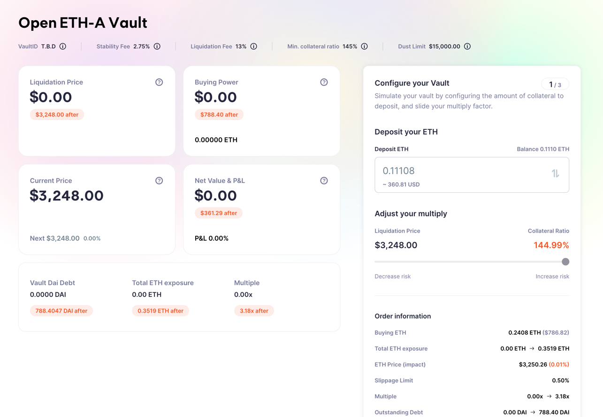

## What is it?

The simple acts of Lending and Borrowing are prominent financial primitives that form the basis of
many more complex financial products.

Just as there are DEXes operated by Automated Market Makers that allow people to swap their coins
seamlessly with each other, there are numerous lending platforms in DeFi.

## Why?

As a lender, you can provide liquidity (deposit coins to borrow) to the protocol in order to
 - earn interest on your deposits from borrowers
 - take out a loan in the form of some other coin using your deposits as collateral

## Rewards

Lending protocols in DeFi let people take out loans from each other seamlessly and transparently;
the interest rates and risk parameters are decided by the algorithms coded into the decentralised
applications — like a bank or a pawn shop, but friendlier.

DeFi protocols often reward their users (borrowers and lenders both, in this case) with native tokens,
typically used to govern future changes to the protocol. 

## Risk implications

When borrowing coins against deposited collateral, it is important to keep an eye on our health ratio;
if the value of our collateral drops too much in proportion to our loan, the system may forcibly
liquidate our funds lest we deposit more or pay back what we have borrowed.

While the interest rates on deposits and borrows are decided algorithmically in a transparent manner,
they typically are not stable but rather fluctuate depending on supply and demand.

In some cases, you may not be able to retreive your deposit in full — if a coin is overborrowed relative
the liquidity depoposited on the platform, for example.

It is important to read the documentation of the platform we intend to use, as the risks involved can
vary greatly depending on the exact implementation.

## Links

https://defillama.com/protocols/lending

https://app.sushi.com/lend

https://app.aave.com/#/deposit

maker
https://oasis.app/

alchemix
https://alchemix.fi/

https://scream.sh/lend

