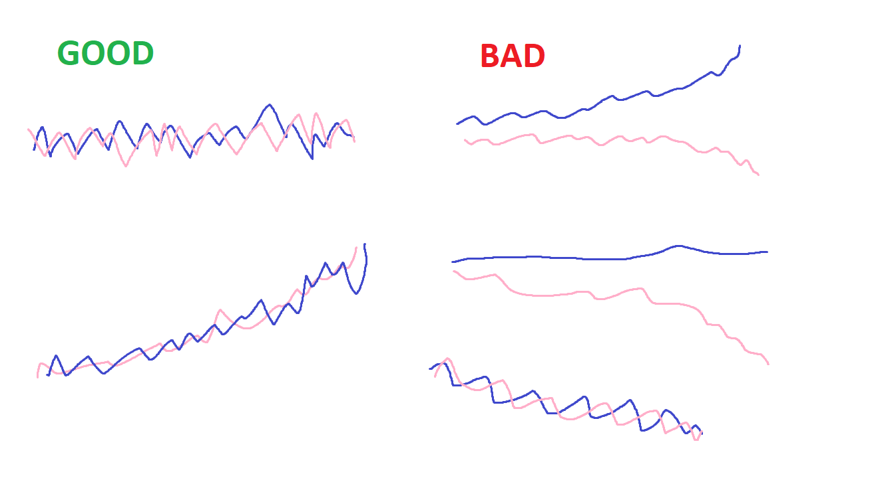

coin - default
  ETH-USDc

Person input:

Input dates
 - From
 - To
 

 
Widget output:

 - squigglies of real data - some kind of data plot UI thing
 
 - fees collected
 - divergence loss suffered
 - net pnl
 - apr ??

- - - 

Person input:

Input coin
 - Coin A
 - Coin B
   (MVP we will default to ETH-USDc)

Input dates
 - Date 1
 - Date 2
 
 Select exchange:
 - xyk 
 - AMM function
 - Curve etc
 
 
Widget output:

 - squigglies of real data - some kind of data plot UI thing
 
 - fees collected
 - divergence loss suffered
 - net pnl
 - apr ??

### Linkies

https://chitty27.pythonanywhere.com/

https://vicyyn.com/
