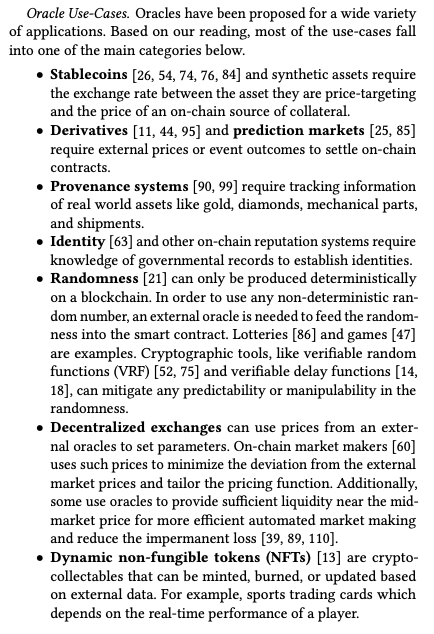
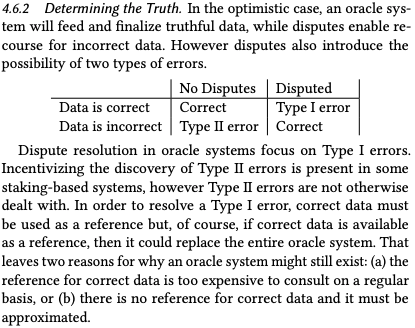
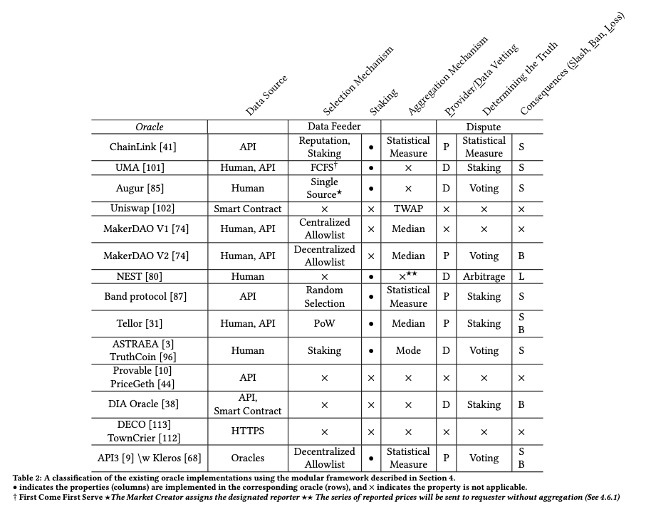
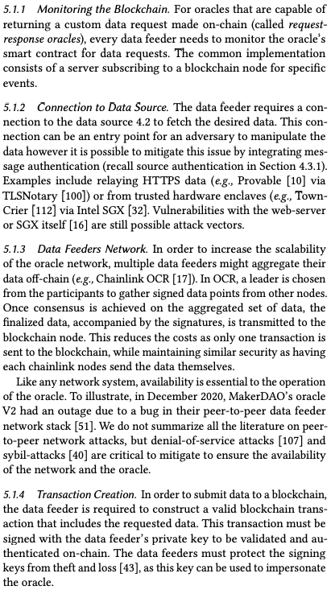
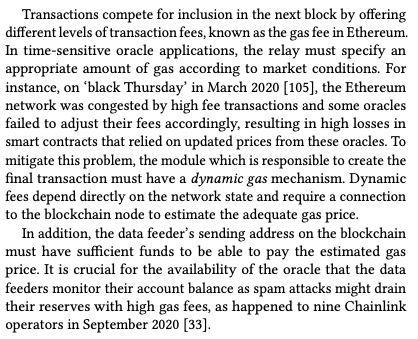

https://blog.makerdao.com/introducing-oracles-v2-and-defi-feeds/

# SoK: Oracles from the Ground Truth to Market Manipulation

https://arxiv.org/abs/2106.00667

> An oracle is a bridge or gateway that connects the off-chain real world knowledge and the on-chain blockchain network. The ‘oracle problem’ [22] describes the limitation with which the types of applications that can execute solely within a fully decentralized, adversarial environment like Ethereum.

Data Sources are defined here as passive entities that store and measure the representation of the ground truth. Common
types of data sources include

- databases
- sensors
- humans
- smart contracts
- or a combination of them

Depending on how data sources gather and retrieve the ground truth, and where a representation of that value relies
upon, there can be different attack types.

...

> For instance, in Maker V2 oracle [74], the selection of the data feeders is done through a decentralized governance process [54]. MKR4 token holders vote on the number of authorized data feeders and who these data feeders can be [28].
> Note that sometimes voting processes can provide the illusion of decentralization while not being much different than a centralized process in practice. To illustrate, consider a project with a governance token, in which most tokens are held by a few individuals where the project leaders advocate for their preferences and there is no established venue for dissenting opinions. If voters only inform themselves from one source of information, that source becomes a de facto centralized decision maker.

> The stake, can be both in token value and reputation of the data feeder. As an example, in Chainlink [41] protocol has a reputation contract that keeps track of the accuracy of data reporting of different feeders. Therefore, the combination of a loss of reputation, penalty fees, and the reduced (or eliminated) income from all future jobs provides the incentive for selected data feeders to act honestly. The module then forms a leaderboard, based on collateral and reputation, to select data feeders from all available data providers.

> In any case, incentives under staking are much closer to being endogenous than in the alternatives.
> Decentralized selection is done by the holders of some scarce token, typically a governance token specific to the oracle service. The simplest decentralized mechanism to hold a vote amongst token holders, who are indirectly incentivized (we call this an exogenous incentive) cast informed votes since they hold a token tied to the success of the system (e.g., TruthCoin [96]). In a staking system, token holders are directly incentivized (a endogenous incentive) to vote ‘correctly’ (this remains to be defined but assume for now it means they vote in a way that will not be disputed) by posting some amount of their tokens as a fidelity bond. Stakers stand to be rewarded with new tokens and/or penalized (collateral slashed) depending on the performance of the data feeders they vote for.

## Evaluation Framework on the selection of data feeders

- No trusted third party
- Low latency
- Resilient to Sybil Attacks
- Resilient to Targeted Denial of Service Attacks
- Incentives are Endogeneous

## Aggregation of Data Feeds

> To improve the quality of simple statistics such as the median and the mode, weights can be applied in the calculation. For instance, to mitigate manipulation of price data, one can choose to use time-weighted average price (TWAP) [102], or liquidity volume, or both [2]. Typically, the liquidity and trading volume of a market correlates with the quality of the price data. To illustrate, Uniswap V2 uses TWAP over several blocks (e.g., mean price in the last 10 blocks) to reduce the possibility of market manipulation in a single block (e.g., via flash loans [88]). In Uniswap V3, TWAP is optimized for more detailed queries including the liquidity volume and allowing users to compute the geometric mean TWAP [2].

## Dispute

Dispute resolution can be

- provider-oriented
- data-oriented

Under a provider-oriented regime, the focus is on selecting honest data providers and using disputes to remove data
providers from serving as oracles in the future. In the optimistic case that providers are honest, oracle data is
available immediately, however if an honest provider is corrupted, it will have a window of opportunity to provide
malicious data before being excluded.

One illustration of a provider-oriented system is operating a centralized allowlist of data providers (e.g., MakerDAO
v2) where providers can be removed. Chainlink [41] strives to decentralize this functionality, where a reputation-based
leaderboard replaces the allowlist.

In a data-oriented regime, the focus is vetting the data itself. This can result in a slower system as oracle data is
staged for a dispute period before it is finalized, however it can also correct false data (not merely remove the
corrupted data feeder from future submissions).

One illustration of a data-oriented system is Tellor [31, 97], where data is staged for 24 hours before finalization. If
it is disputed, a period of up to 7 days is implemented to resolve the dispute.

It is also possible that a system allows the resolution itself to be further disputed with one or more additional
rounds. In Augur [85] for instance, the dispute step may happen in one round (takes maximum 1 day) or may contain other
rounds of disputes that can last more than 7 days.

- staking
- slashing
- voting

> One final truth discovery mechanism is arbitrage which is applicable in the narrow category of exchange rates between two on-chain tokens

Consequences for incorrect data feeders:

- ban / suspension
- reputational loss
- economic loss

## Interacting with the blockchain

> While the initial inputs to an oracle are generally off-chain (with the exception of pulling data from another smart contract) and the final output is by definition on-chain, the oracle designer will choose to implement the intermediary modules—data feeder selection, aggregation and dispute resolution—as either off-chain or on-chain. Generally, on-chain modules are preferred for transparency and immutability, while off-chain modules are preferred for lower costs and greater scalability.

### Off-chain Infrastructure

- For on-chain financial data, e.g. Uniswap, not needed obviously
- Single server, e.g. Town-Crier (?)
- Many nodes intercommunicating through their own consensus protocol, e.g. ChainLink

Availability and DOS-resistance are core requirements of off-chain infrastructure, especially for time-sensitive data
with high update frequency.

### Blockchain Infrastructure

#### Blockchain node

A blockchain node relays transactions to the other nodes in the network for inclusion in the blockchain. The node is
responsible for storing, verifying, and syncing blockchain data. The availability of nodes is very important for the
oracle system, as a blocked node cannot send transactions.

Extensive research on network partitioning attacks apply to decentralized networks, with the main objective of
surrounding an honest nodes with the malicious nodes. This results in the node believing it is connected to the
blockchain network when it is not.

#### Block Creation

Transactions that have been circulated to the blockchain network are stored in each node’s *mempool*. Mining nodes
select transactions from their mempool according to their priorities (e.g., by highest gas price as in *Geth*, while
respecting nonces).

*Front-running* attacks try to manipulate how miners sequence transactions. For example, someone might observe an
unconfirmed oracle transaction in the mempool, craft a transaction that profits from knowing what the oracle data will
be, and attempt to have this transaction confirmed before the oracle transaction itself (called an *insertion attack*).
This might be conducted by the miner themself. In this case, it is called *transaction reordering*, and the profit
miners stand to make from doing this is termed **Miner Extractable Value (MEV)**).

Other nodes or users on the network who can act quickly and offer high fees can also conduct front-running attacks.
Users might also attempt a *bulk displacement attack* that fills the consecutive blocks completely to delay reported
data from oracles. There could be a profit motive for this attack if the oracle data becomes expired, or if the data
feeder’s collateral is slashed and redistributed to the attacker.

Research on MEV (e.g., Flashbots) has shown the possibility of new type of attacks based on reordering the transactions,
such that if there’s a high profit for changing the order of some transactions in a (few) blocks, miner is incentivized
to use his hash rate to perform a reorganization attack, and profit from the execution of the newly ordered
transactions.

For instance, Uniswap uses the last price in a block to determine the average price (TWAP), in which a miner can add new
trades while reordering the past trades with the goal of manipulating the price average to profit on other applications
that uses Uniswap as price oracle.

#### Consensus

The goal of the consensus algorithm used in the blockchain is to verify and append the next block of transactions to the
blockchain. If the nodes do not come to agreement on a state change, a fork in the network happens with different nodes
trying to finalize different forks of the blockchain.

Given the network is decentralized, short-lived forks happens frequently in the network that generally are resolved
within a few blocks. All valid transactions in the abandoned fork will eventually be mined in the main chain, likely in
a new order (called *reorganization* or a *reorg*).

A reorg opens the possibility of attacks by using known, unconfirmed, transactions from the abandoned fork. To
illustrate, consider Etheroll, an on-chain gambling game where users bet by sending a number that payouts if it is
smaller than a random number determined by an oracle. To prevent front-running from the mempool, the Etheroll oracle
would only respond when a bet was in a block. Despite this mitigation, in April 2020, the Etheroll team detected an
ongoing front-running attack on their platform. The attacker was betting rigorously and waiting for small forks—
collected by Ethereum in *uncle blocks*—where the original bet and oracle’s random number response were temporarily
discarded by the reorg. The attacker would place a winning bet with a high fee to front-run the original bet and
eventual inclusion of the oracle’s transaction in the reorganized chain.

A general principle of this attack is that even if oracle data bypasses the mempool and is incorporated directly by
miners, front-running through reorgs is still possible.

There are two solutions to front-running through reorgs. The first is to delay the settlement of the bet by a few blocks
to prevent issues caused by small reorganization forks. The second is to incorporate a *hash* of the request (e.g., *
request-id*) in the response to prevents the request (e.g., bet) from being swapped out once the response (e.g., random
number) is known.

> Other consensus attacks [12, 53, 58] exist but are less related to oracles. We omit discussion of them.

### Smart contracts

Although oracles are usually designed to be the source of truth for on-chain smart contracts, some smart contracts can
also be used as oracles by others even though they were not designed with the oracle use-case in mind.

To expand this idea, oracles could be a *’an end in itself’*, which is to say they are designed specifically to be used
as a source of truth. These oracles fetch the data from external sources and make it available on-chain (e.g.,
PriceGeth).

By contrast, a *means to an end* oracle is a contract that produces useful data as a byproduct of what it is otherwise
doing. Examples are on-chain markets and exchanges like Uniswap and other automated market makers (AMMs). The markets
are designed for facilitating trades but provide pricing information (price discovery that can be used by other
contracts (e.g., margin trading platforms) as their source of truth.

##### Oracle Interaction Models

A distinction in the oracle design is whether the interaction between with the consumer’s contract is implemented as a *
feed*, a *request-response*, or the related *subscribe-response*.

A Feed is a smart contract system that publishes the data for others to use. It does not require any requests to fetch
the data and using an interval to update the data on its smart contract (e.g., Maker DAO Oracle). From a technical
aspect, in order to use a feed oracle, the smart contract only needs to query the smart contract and no additional
transactions are needed.

The Request-Response model is similar to a client-server API request on traditional web development. The requester must
send a request to the oracle’s smart contract, which then is picked up by the off-chain module of the oracle to fetch
the requested data from the data source. The data is then encapsulated in a transaction and sent back to the data
requester smart contract through the oracle’s smart contract. Due to the nature of this design, at least two
transactions are needed to complete the work flow, one from the requester and another for the responder.

The Subscribe-Response model is similar to Request-Response with one main difference, the request does not need to be in
a transaction. If there is pre-arranged agreement, the oracle will watch for emitted events from the requester smart
contract and respond to the requests. Alternatively, the requester is allowed to read the feed through an off-chain
agreement (e.g., API3).

#### Oracle’s Smart Contract

Could include:

- data feeder selection
- aggregation
- dispute resolution

In addition, can be used as the data feed storage for other smart contracts to read from, or to authenticate the
oracle's response on the consumer smart contract.

Potential attacks on the oracle's smart contract:

- implementation flaws (e.g. manipulation of uniswap markets that are used as oracles by oracles)
- governance

#### Data Consumer Smart Contract

In the feed model, the data consumer smart contract relies on oracles to fetch the required data in order to function as
intended. It is essential to use oracles with multiple data feeders and a proper aggregation methods.

To illustrate the importance, consider the lending service Compound which initially only used Coinbase Pro as their data
feeder without any aggregation mechanisms. In November 2020, a faulty price feed on Coinbase Pro, resulted in
undercollarization of Compound loans and a liquidation of $89 million dollars of the collateral. This could have been
prevented by using an oracle with sufficient data feeders and a proper aggregation mechanism.

Due to the commonality of this issue, there has been some Ethereum Improvement Proposals (EIPs) to standardize the
interface of the oracles implementing a feed (e.g., EIP-2362). An interface would allow data consumer smart contracts to
easily switch between feeds or use multiple oracle feeds in their logic.

In the request-response model ... failure to verify the oracle’s response could result in malicious data injection in
the data consumer smart contract.

To illustrate, the insurance service Nexus Mutual implemented an oracle’s response function (or callback) without any
proper access control. This opened the possibility of unauthorized entities providing data updates which would be
wrongfully assumed to have originated from the oracle’s smart contract.

# Other linkies

https://oracles.club/

[Blockchain Oracle Design Patterns](https://arxiv.org/abs/2106.09349)
  
