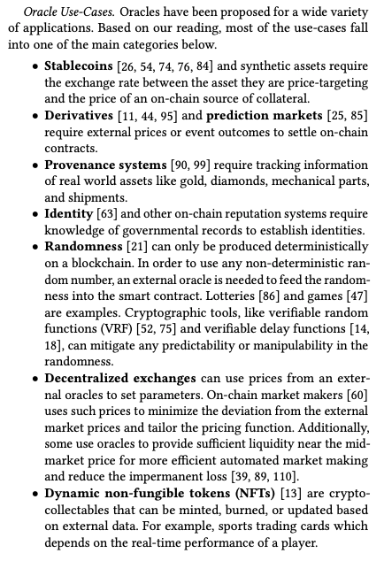
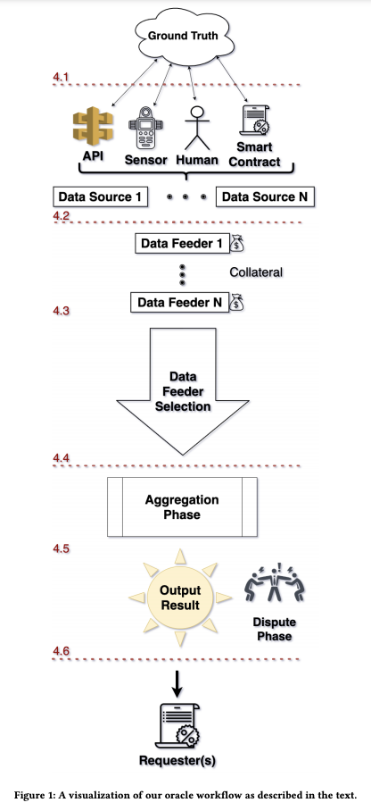
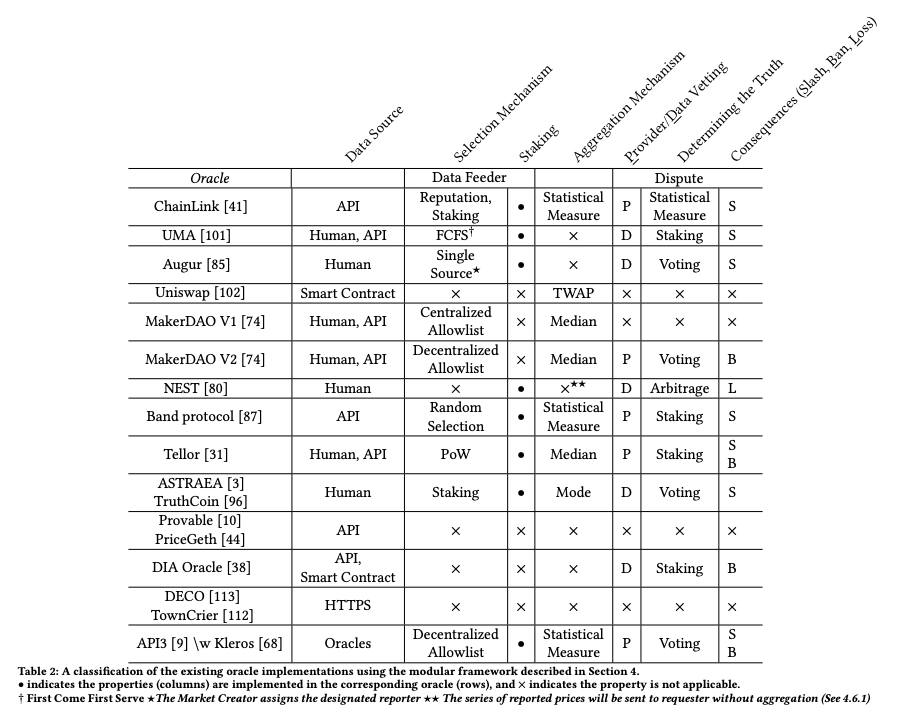

https://blog.makerdao.com/introducing-oracles-v2-and-defi-feeds/

## SoK: Oracles from the Ground Truth to Market Manipulation

> An oracle is a bridge or gateway that connects the off-chain real world knowledge and the on-chain blockchain network. The ‘oracle problem’ [22] describes the limitation with which the types of applications that can execute solely within a fully decentralized, adversarial environment like Ethereum.

Data Sources are defined here as passive entities that store and measure the representation of the ground truth. Common types of data sources include 
 - databases 
 - sensors
 - humans
 - smart contracts
 - or a combination of them

  Depending on how data sources gather and retrieve the ground truth, and where a representation of that value relies upon, there can be different attack types.
  
  