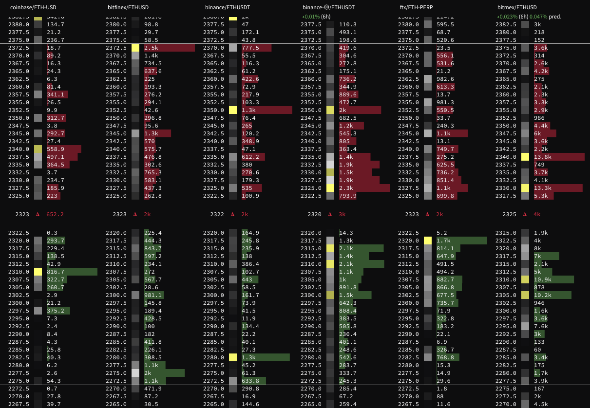
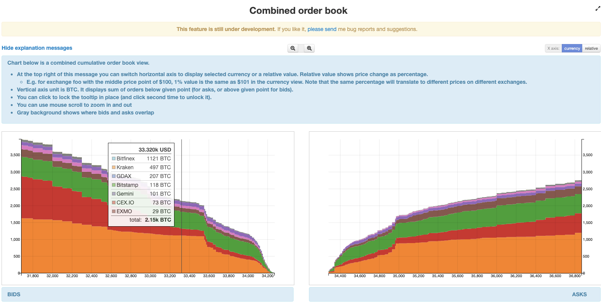
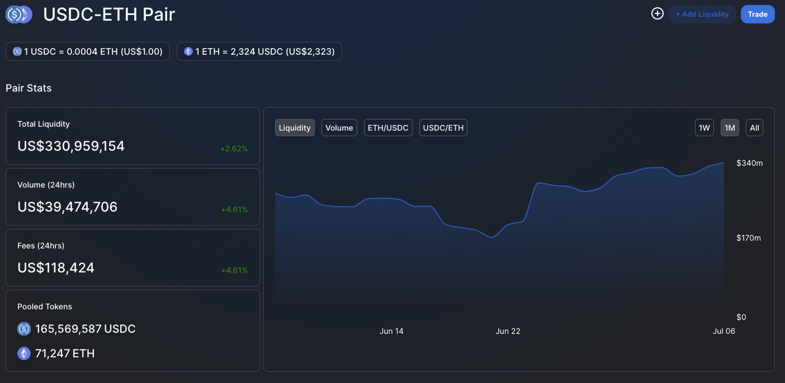

### What SHORT
In finance and economics, the term liquidity is used to describe assets, markets, and people/firms. In essence, a market (or asset) is liquid if it is available to trade in large quantities, i.e. the asset can be bought or sold with ease without significantly affecting its price. Cash can be seen as the most liquid asset, as it can be directly "sold" in exchange for goods and services with no loss of value.

### Why?
In traditional financial markets, prices are determined and assets are exchanged using order books - **makers** provide liquidity by sending their passive orders to the exchange, e.g. selling 10 of something at $12, 20 at $15 and 30 at $20 etc. The passive orders are matched to **takers** who want to buy (or sell) instantly at the best available price by the matching engine.

In DeFi, people instead typically deposit their funds into liquidity pools which are managed in a transparent and predictable way by **Automated Market Makers**, allowing other people to trade their goods without a centralised trusted intermediary.

### What LONG
RL example of inf liquidity -> contrast to volatile speculative stuff

We rarely run out of snickers and redbull so its stable and dont need to think about liquidity when trading them
Supply demand changes more erratically for stonks and especially cryptos...

CLOB vs AMM

throughput constraints, more accessible for noobs (worth noting that you can manage your LP position actively and probably get hurt by default if you just lazy LP, which is why the yield ponzi rewards are somewhat necessary)
The simplicity of a liquidity liquidity pool makes it robust in a way - mebbe liquidity in a pool can be utilized for more things at once something something

...

Something something see also / liquidation (on margin exchanges, or lend/borrow protocols, typically...)

### Risks
 - Depending what your liquidity is used for:
 	- Divergence loss
 	- Something something on borrow/lend platforms idk what its called...
 - Generic contract exploit / failure
 - ..?

### Rewards
 - Fees
 - Divergence loss can be a nonissue depending on taste..?
 - Boosted ponzi yields~
 - ..?

### Math / Diagram

### Links / Refs
https://academy.binance.com/en/articles/what-are-liquidity-pools-in-defi

https://academy.binance.com/en/articles/what-are-makers-and-takers

https://academy.binance.com/en/articles/what-is-an-automated-market-maker-amm

https://www.wikiwand.com/en/Market_liquidity

https://data.bitcoinity.org/markets/books/USD

https://info.uniswap.org/#/

https://okotoki.com/